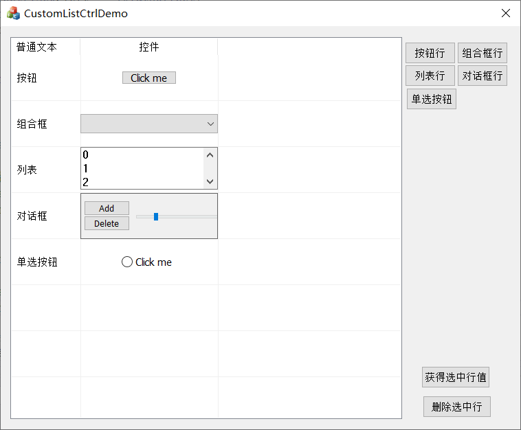

##ListCtrlCustom是什么?

一个可以把任意控件与子窗口放在格子里的列表控件，工作在MFC下。

##ListCtrlCustom使用

* 1.1拖一个ListCtrl到界面，`并将ListCtrl控件的Style属性改为Report`
* 1.2或使用new出来的方式：

```C++
m_pListCtrl = new CListCtrlCustom();
m_pListCtrl->Create(WS_CHILD | WS_VISIBLE | WS_BORDER, rcListCtrl, this, IDC_STATIC_RECT+1);
```
* 2.使用以下API进行相关操作

```C++
//获取某格子的控件，如果此格式没有控件则返回NULL
CWnd *GetCtrl(int nRow, int nCol);

//获得格子的文本，如果此格子有控件则获得控件文本，否则获取格子文本
CString GetText(int nRow, int nCol);

//把控件添加到格子中
BOOL SetItemEx(int nItem, int nSubItem, CWnd *pExCtrl);

//设置行高
BOOL SetRowHeight(int nHeight);

//注册自定义格子中的控件行为
void RegOnSettingRect(LPFUNC_RESIZE_CTRL pfnResizeExCtrl);
```


##截图


